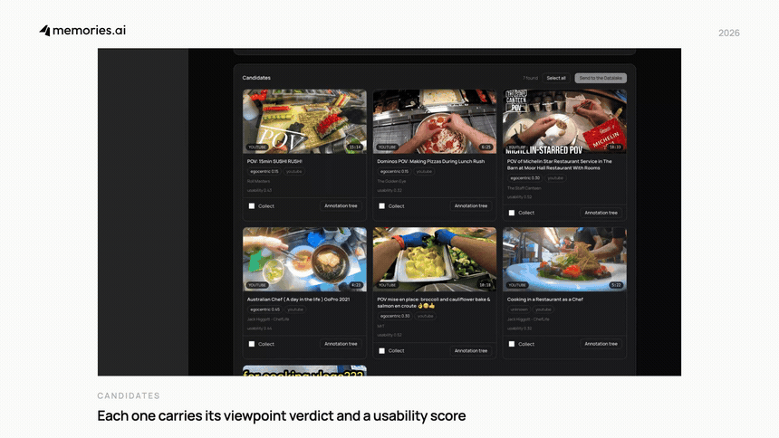
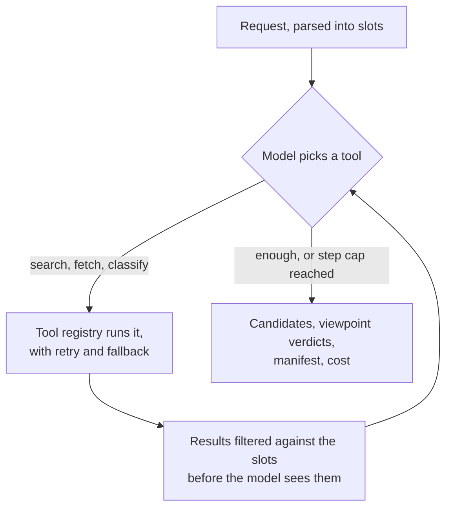

# Internet2EgoExo

**Turn internet-scale video into egocentric and exocentric training data.**

Search the open web for first-person and third-person footage, confirm the
viewpoint against real frames before paying for anything, then let agents on the
[Memories.ai](https://memories.ai) video datalake curate and annotate whatever
survives.

[](LICENSE)


## Demo

One real run: a plain-language ask, a live search, the frame check that rejects
the wrong viewpoint before anything is paid for, the cost ledger, and a finished
clip with its task and action tree.

[](docs/demo.mp4)

**[Watch the full 92-second run](docs/demo.mp4)** (1280x720). The search in it
really took 71 seconds, and that stretch is labelled as sped up on screen rather
than passed off as real time.

## What it does

You state a goal the way you would say it out loud, not as a set of filters:

> find me first-person cooking footage, hands must be visible, two hours of it

and the loop runs:

| Stage | What happens |
|-------|--------------|
| **Search** | YouTube, TikTok, Instagram, X and the open web, in one pass |
| **Fetch** | The bytes come from a paid provider, routed per platform. No extractor |
| **Frame check** | Frames are sampled and the viewpoint is decided on pixels, before a cent is spent on indexing |
| **Index** | Whatever passes goes into the Memories.ai video datalake |
| **Clean** | A cleaning agent cuts the usable spans out of long recordings |
| **Annotate** | An annotation agent writes the task, action and event tree |
| **Curate** | A curation agent grades the set against executable quality gates |

What comes out is a directory of clips with annotations, a manifest, and a bill
for what an hour of it cost.

## What it is strict about

**No hands, no clip.** First-person footage without hands in it is just ordinary
footage. This is the one rule with no override.

**Never mix hour counts.** `worn`, `delivered`, `accepted` and
`accepted_labeled` are four different numbers. Only `accepted_labeled` is safe
to quote outward.

**Unmeasured is not passed.** A quality check that could not be measured is
dropped from the score rather than assumed to have passed.

## Where to look

| Section | For |
|---------|-----|
| [How the agent decides](#how-the-agent-decides-what-to-do) | slots, the loop, the answer |
| [The pipeline, end to end](#the-pipeline-end-to-end) | one request, followed all the way through |
| [The agents](#the-agents) | what each agent is judged on |
| [How a candidate is judged](#how-a-candidate-is-judged) | the standard, as executable checks |
| [The dataset on disk](#the-dataset-on-disk) | what you actually get handed |
| [Cost per hour](#cost-per-hour) | how the bill is worked out |
| [Web UI](#web-ui) | run the whole loop in a browser |

## What you get

| | |
|---|---|
| **Sources** | YouTube, TikTok, Instagram, X, and the open web: dataset pages, lab sites, archives. Exa for neural search, Apify for scraping |
| **Viewpoint verdicts** | Every candidate is called egocentric, exocentric or unknown, and the cues behind the call are kept with it |
| **Licence filtering** | Narrow to Creative-Commons material that is safe to reuse |
| **Volume goals** | Ask for hours, not clip counts. The run reports progress against the target and which constraint was binding |
| **Manifest** | Every clip with its viewpoint, confidence, duration, licence and usability score, as JSONL or CSV |
| **Annotation tree** | Task, action and event on time anchors, with per-span hand and object labels written back as tags |
| **Cost ledger** | Discovery, download, indexing and annotation priced from published rates, per hour collected and per hour delivered |
| **Web UI** | The whole loop in a browser, with no build step |

## How the agent decides what to do

Your sentence becomes slots. An agent loop then picks tools until it has enough,
and reports what it found.

**Slots.** A Gemini model reads the request and pulls out what is actually being
asked for. It runs through OpenRouter by default, or Google directly; see
[The models](#the-models-one-key-or-googles).

```python
# "first-person cooking footage from YouTube, at least 5 minutes, 2 hours of it"
ParsedQuery(
    platforms=["youtube"],
    topics=["cooking"],
    viewpoint=Viewpoint.EGOCENTRIC,
    min_duration_seconds=300,
    target_hours=2.0,
)
```

**The loop.** Up to ten steps by default, set with `MAX_AGENT_STEPS`. Results are
filtered inside the loop, before the model sees them, so it never reasons over
candidates that already fail the request.



**The answer.** An `AgentResponse`: the written `answer`, `video_references`
with their metadata and viewpoint verdicts, a `dataset` summary, `usage_metrics`
for tokens and cost, and the `parsed_query` it actually worked from.

For what happens to a candidate after it is found, read
[the pipeline](#the-pipeline-end-to-end).

## Related Work

This is not a model and not a dataset — it is the step in between: turning the
open internet into ego/exo footage that is viewpoint-labelled, licence-checked,
hands-verified, annotated, and priced per delivered hour. The literature it sits
next to mostly does one of two other things.

**Commissioned capture.** [Ego-Exo4D](https://arxiv.org/abs/2311.18259)
(1,286 h, 740 participants, simultaneous ego + multi-exo),
[Ego4D](https://ego4d-data.org/) (3,670+ h),
[EPIC-KITCHENS-100](https://arxiv.org/pdf/1804.02748),
[EgoExoLearn](https://github.com/OpenGVLab/EgoExoLearn) — recruited
participants, consented sites, a fixed taxonomy. You get exactly the scenes you
funded. Here the footage already exists, so the budget goes into *verification*
instead of recording.

**Consuming a pool somebody else built.** [EgoDex](https://arxiv.org/html/2505.11709v1)
(829 h, SE(3) hand annotations), [EgoScale](https://arxiv.org/abs/2602.16710)
(20,854 h), [HumanNet](https://arxiv.org/abs/2605.06747) (1 M h — where 1,000 h
of egocentric human video *matched or modestly surpassed* 100 h of real-robot
data under fixed validation, against a 20,000 h upper bound it does not reach).
Those results are the economic case for collection; this repo is the collection.

Worth keeping the denominator in view: **[DROID](https://droid-dataset.github.io/),
the flagship open teleoperated robot dataset, is 350 hours** — thirteen
institutions, fifty collectors, twelve months. HumanNet's "100 h of robot data"
baseline is close to a third of it. Robot data is not merely expensive per hour;
there is almost none of it by comparison.

Two neighbours are worth calling out directly:

- **[SiMDex](https://arxiv.org/abs/2608.04196)** reaches our thesis from the
  other side of the pipe — mining <5 % of a 32 M-sample pool beats an equal-size
  random draw. Selection, not volume, is the bottleneck.
- **[NVIDIA Cosmos](https://arxiv.org/abs/2501.03575)** generates and evaluates
  data; we source it. Cosmos Curator presupposes a 20 M-hour archive — this is
  how a team without one gets to its first defensible thousand hours.

And one gap that shapes the design. Retrieval over the indexed corpus is
any-to-any across *modalities* — [OmniRetriever](https://arxiv.org/abs/2605.26641)
does text/video/audio in one space — but the axes that decide whether a clip is
usable training data are not modalities. Viewpoint, hands in frame, licence,
usable length after trimming: none of them fall out of a similarity search. They
have to be asserted by an agent, justified with evidence, and written back as
metadata. That is what the viewpoint classifier, the hands gate, the annotation
tree and the four hour measures are for. Retrieval finds candidates; it does not
certify them.

### What already exists in open source

The chain here — crawl → decide viewpoint → clip → annotate — exists stage by
stage as downloadable code, and the survey maps each one:
[`video2dataset`](https://github.com/iejMac/video2dataset) and
[LAION BVD](https://github.com/LAION-AI/BVD) for bulk fetch,
[Panda-70M](https://github.com/snap-research/Panda-70M)'s `splitting/` for
semantic cuts, [`cosmos-curate`](https://github.com/nvidia-cosmos/cosmos-curate)
as an industrial skeleton. Three things are worth knowing before planning around
them:

- **Generative exo → ego does not scale.** [Exo2Ego-V](https://github.com/showlab/Exo2Ego-V)
  needs four synchronised 360°-surround views with known poses; the web has none.
  What works is *filtering* — [RynnVLA-001](https://arxiv.org/pdf/2509.15212)'s
  rule (face keypoints → discard, hand keypoints → keep) is independent
  corroboration of the viewpoint and hands gates here — or *lifting to 4D and
  reprojecting*, as [EgoInfinity](https://arxiv.org/abs/2606.17385) does, though
  it assumes a roughly static camera and explicitly excludes head-mounted
  footage.
- **The licence trap.** EgoInfinity's own code is MIT, but WiLoR is CC-BY-NC-ND,
  Ultralytics YOLO is AGPL-3.0 and MANO is non-commercial — the repo states that
  commercial use *as a whole* is restricted. EgoDex, the field's favourite
  hand-annotated reference set, is CC-BY-NC-ND outright. A dataset inherits the
  restrictions of every model and corpus used to build it, which is the same
  per-clip rights discipline this project applies to footage, pointed at the
  toolchain. The survey maps the whole chain —
  [who feeds whom](docs/RELATED_WORK.md#who-feeds-whom--the-derivation-map) — and
  two chokepoints carry most of the risk, both CC-BY-NC-ND: **EgoDex** sits
  inside at least four downstream corpora and models, **WiLoR** inside at least
  three annotation pipelines. A no-derivatives clause at a junction that many
  things route through is the single most consequential licensing fact in the
  field. (Nothing there alleges non-compliance by anyone; the point is what a
  reader can determine from the public artefacts, which is not much.) And an
  unresolved licence is a snapshot, not a property: re-checking this sweep,
  InternVid — long recorded in the survey as stating none — now carries
  **CC BY-NC-SA 4.0** and is gated, the most restrictive combination in the
  document. Terms change quietly, so the survey re-reads them rather than
  inheriting them.
- **Hours are being commoditised — but pixels are not.** Build AI went from
  [Egocentric-10K](https://www.humanoidsdaily.com/news/build-ai-open-sources-10-000-hours-of-factory-worker-video-to-scale-robot-learning)
  (10,000 h, 1080p) to
  [Egocentric-100K](https://huggingface.co/datasets/builddotai/Egocentric-100K)
  (100,405 h, 10.8 B frames, **456×256**), both Apache 2.0. Note what scaling
  cost: a 17× drop in pixels per frame, in a domain where finger articulation is
  the payload. And note how it landed — the publisher's own listing shows
  the 256p corpus pulled **164,868** times last month against the 1080p corpus's
  **34,519** — roughly **4.8:1**. An earlier revision of this README quoted
  470:1 off an older reading; the survey records why that was wrong on two
  counts (the counter is a rolling monthly *rate*, not a lifetime total, and the
  gap has since closed by two orders of magnitude). The direction still holds —
  the field does reach for hours first — but the opposite bet, that legibility
  is what a manipulation corpus is *for*, is a less lonely place to stand than
  it looked. And it is not one publisher's quirk:
  [SABER](https://arxiv.org/html/2605.09613v1) records its egocentric stream —
  in a corpus whose declared payload is dexterous hand-pose trajectories — from
  head-mounted GoPros at **480p**. (A widely-reported ~1 M-hour follow-up to
  Egocentric-100K could not be found at the publisher across four attempts; the
  survey records each one.)
  Consent posture is a design choice, not a casualty of scale: the 10K card warns
  against surveillance uses while carrying no consent documentation, where
  [Open-AoE](https://arxiv.org/abs/2607.14183) collects under explicit informed
  consent with face masking in-pipeline.

### Why no open-source project does exactly this

Every individual stage is open. The assembly is not — and the reason is
structural, not technical.

**Two projects come close, and saying exactly how keeps the rest honest.**
[EgoCS-400K](https://arxiv.org/html/2606.18180v1) sources ego data from the open
internet at scale — 10,000+ hours, CC BY 4.0, from public Counter-Strike match
demos on HLTV — but it works because the domain ships a deterministic replay
format: the video is *rendered* rather than downloaded, and the actions are
*read out of the file* as ground truth. Viewpoint is a render parameter; there
is no camera to classify. And [HumanNet](https://arxiv.org/abs/2605.06747) is
the bigger one: **one million hours of real human video**, assembled from
"video-platform search, general web search engines, directly crawled videos,
open-source datasets, and self-collection", with self-collection described as
complementing *web-scale acquisition*. Its follow-up
[HumanScale](https://arxiv.org/html/2606.20521) then beat 5,000 hours of
real-robot teleoperation with 5,000 curated egocentric hours at matched scale.

**So "nobody does this" is simply false, and the survey says so** — it asserted
the flat version for twenty-five sweeps while carrying the refutation in its own
§2. What is missing is not the act but the artefact. HumanNet is not released:
no dataset licence, no public release strategy, no code beyond a promise. It is
not auditable: no breakdown of the million hours by source, no ego/exo split, no
per-clip provenance, and a rights review that is asserted rather than published.
And it is a corpus, not a machine — it answers "here are a million hours", not
"here are the hours matching this requirement, with evidence". **The gap is the
acquisition layer as open, auditable, reusable infrastructure**, and that gap is
real: whatever was built to assemble those hours, none of it is downloadable.

That HumanNet exists is good news for the premise here, not bad — it is the
largest demonstration anywhere that the supply is real and that mining it works.

On tooling, open source went hard at the two adjacent problems
and skipped this one: **capture** ([EgoKit](https://arxiv.org/pdf/2605.16797),
[MobileEgo Anywhere](https://arxiv.org/pdf/2605.05945) — how to record more
footage cheaply) and **annotation** ([EgoLive](https://arxiv.org/html/2604.23570v1),
Action100M — how to label footage you already hold). Acquisition from the open
web is the hole between them: the tools that touch the internet are
viewpoint-blind by construction, and published guidance for sourcing ego footage
still amounts to *manually searching YouTube for "egocentric view"*.

**The strongest single piece of evidence is what the best-resourced actor did.**
When NVIDIA needed the largest egocentric corpus ever assembled for a world model
— [DreamDojo](https://arxiv.org/html/2602.06949), 44,711 hours — it
**crowdsourced 43,827 of them**, took 829 from EgoDex and shot 55 in-lab. Not one
hour is described as found footage. The company that also ships the world-model
platform, the curation substrate and the largest ego VLA still paid for capture
rather than mining the web.

And the four positions rest on fewer than four acquisitions. DreamDojo and
[EgoScale](https://arxiv.org/abs/2602.16710) report **identical scene, task and
object counts** — 9,869 / 6,015 / 43,237 — and the same 829-hour EgoDex
component, in two papers from the same lab that never cite each other. So the
corpus behind the world model and the corpus behind the VLA are, on the face of
it, one corpus. Which sharpens the point rather than softening it: the
best-resourced actor in the field bought its hours **once** and built everything
downstream on that single purchase, because there was no second way to get them.

**The newest work keeps confirming it, in two ways.** By staging what the web
already holds: [SABER](https://arxiv.org/html/2605.09613v1) needed ~100 hours of
grocery stocking and shelf retrieval — among the most abundantly filmed activity
on the open internet — and sent actors into real stores with head-mounted
GoPros. And by calling something in-the-wild that isn't:
[EgoWAM](https://arxiv.org/abs/2607.08436) reports that world-action-model
co-training "scales more effectively with in-the-wild egocentric human data,"
where the in-the-wild data is EgoVerse, captured on Project Aria glasses, with
its 3D flow derived from the glasses' own VIO poses. In this literature
*in-the-wild* means outside the robot's lab — never off the open web.

It stays a hole because the citable unit is a corpus rather than a machine;
because where it pays, the sourcing pipeline is the product and gets kept;
because a tool that automates search → download → licence filtering carries legal
exposure a dataset release does not; because "collect N hours matching this
requirement" has no stable interface to standardise around; because the hard
parts are contested judgement rather than deterministic transforms; and because
the scaling results that make it worth paying for are about a year old.

So the missing piece is specifically the **acquisition layer** — requirement →
search → viewpoint proof → rights proof → manifest — as something you can
obtain, inspect and re-run. That is what this repo is, and it is why it reuses
the stages the field has already solved rather than reimplementing them.

**What would falsify that**, stated so you can check rather than take it on
trust: a public release, under terms permitting reuse, of a system that takes a
stated requirement and returns clips with per-clip viewpoint evidence, rights
provenance and acceptance status. Not a corpus — corpora exist, several are
enormous, and HumanNet's is the largest. A *machine*, whose outputs audit back
to their sources. If one appears, the survey says it should be edited to say so
rather than defended.

Full survey — both halves, the positioning table and references:
**[docs/RELATED_WORK.md](docs/RELATED_WORK.md)**. It also carries a
[corrections table](docs/RELATED_WORK.md#corrections-in-one-table) indexing every
widely-repeated claim that did not survive being checked at its source —
including three of the survey's own, kept visible rather than quietly amended.

## Installation

```bash
# Clone the repository
git clone https://github.com/Memories-ai-labs/Internet2EgoExo.git
cd Internet2EgoExo

# Install dependencies
pip install -e .

# Or with uv
uv pip install -e .
```

## Configuration

Create a `.env` file with your API keys:

```bash
# Required
GOOGLE_API_KEY=your_google_api_key
YOUTUBE_API_KEY=your_youtube_data_api_key
MEMORIES_API_KEY=sk-mai-your_datalake_api_key
MEMORIES_BASE_URL=https://api.memories.ai/serve/datalake/v1

# Optional
MEMORIES_COLLECTION_ID=            # index into an existing collection
MEMORIES_COLLECTION_NAME=video-searching-agent
MEMORIES_INDEX_FPS=1.0
MEMORIES_INDEX_WAIT_SECONDS=120    # how long one call waits for indexing
EXA_API_KEY=your_exa_api_key
APIFY_API_TOKEN=your_apify_api_token   # also how YouTube videos get downloaded
VIEWPOINT_CHECK=frames                 # off | frames | watch — see PRE-SIGHT
```

### Getting API Keys

1. **Google API Key** (required): Get your Gemini API key at [Google AI Studio](https://aistudio.google.com/apikey)
2. **YouTube Data API Key** (required):
   - Go to [Google Cloud Console](https://console.cloud.google.com)
   - Create a project and enable YouTube Data API v3
   - Create an API key
3. **Memories.ai API Key** (required): Create a Video Datalake key (`sk-mai-...`) in the [Console](https://console.memories.ai) → API keys. Indexing is billed per minute of video — see [pricing](https://docs.memories.ai/datalake/pricing)
4. **Exa.ai API Key** (optional): Sign up at [exa.ai](https://exa.ai) for neural web search
5. **Apify API Token** (recommended): Sign up at [apify.com](https://apify.com). It scrapes TikTok, Instagram and X — and it is how YouTube videos are downloaded, which matters more than it sounds:

   yt-dlp no longer works against YouTube from a datacentre address. It fails
   with *"Sign in to confirm you're not a bot"*, which is not a transient
   error — it is YouTube declining to serve any IP range that looks like a
   server, and every host this pipeline realistically runs on (a container, a
   CI runner, a serverless function) sits in one of those ranges. So for
   YouTube:

   * **metadata** comes from the YouTube Data API, which is free, answers in
     one round trip, and states outright whether a video is Creative Commons
     (`status.license`) — a Gate 0 fact that the extractor was always vague
     about;
   * **the file** comes from an Apify downloader actor, which fetches it from a
     residential address into Apify's key-value store, from where this process
     streams it to disk on the way to the Datalake.

   The other platforms are fetched the same way, through the scrapers the
   search already calls, with their download flag on.

   **There is no extractor path at all any more.** `yt-dlp` was the download
   route for everything except YouTube, and it does not work: TikTok fails with
   *"Unexpected response from webpage request"* on every attempt, so a run
   surfaced good TikTok candidates, charged for the search, and then reported
   `failed` for reasons that said nothing about the footage. Fetching is now
   routed per platform across providers:

   | `DOWNLOAD_PROVIDERS` | Credentials | State |
   |---|---|---|
   | `apify` (default) | `APIFY_API_TOKEN` | Verified against the live API for YouTube, TikTok, Instagram and X |
   | `rapidapi` | `RAPIDAPI_KEY`, `RAPIDAPI_HOST` | Written to the documented API, **never executed** |
   | `brightdata` | `BRIGHTDATA_TOKEN`, `BRIGHTDATA_ZONE` | Written to the documented API, **never executed** |
   | `oxylabs` | `OXYLABS_USERNAME`, `OXYLABS_PASSWORD` | Written to the documented API, **never executed** |

   Set it to an ordered list — `DOWNLOAD_PROVIDERS=apify,brightdata` — and each
   is tried until one hands back a media URL. A provider with no credentials
   reports itself unavailable and is never asked, so an unverified one cannot
   quietly become the provider a run depends on. When all of them refuse, the
   error names every attempt rather than one extractor.

## Quick Start

```python
import asyncio
from video_searching_agent import VideoSearchingAgent

async def main():
    agent = VideoSearchingAgent()

    response = await agent.query(
        "find me first-person cooking footage, hands must be visible"
    )
    print(response.answer)

    # Every candidate carries its viewpoint verdict and the cues behind it.
    for ref in response.video_references:
        print(f"- {ref.title}: {ref.url}")

asyncio.run(main())
```

## The pipeline, end to end

One request — *"find me first-person cooking footage, hands must be visible"* —
runs the whole way through. Nothing below is a separate product: it is one path,
and each leg is owned by an agent whose job is narrow enough to be judged on its
own output.

```
                      ┌──────────────────────── you ────────────────────────┐
                      │  "all first-person cooking videos, hands visible"   │
                      └───────────────────────────┬─────────────────────────┘
                                                  ▼
 1  SEARCH        search agent        YouTube · TikTok · Instagram · X · web
                                     viewpoint classification, usability ranking
                                                  ▼
 2  SCREEN        cleaning agent      licence · length · viewpoint     ← spends nothing
                                                  ▼
 3  LOOK          cleaning agent      a few real frames, not the words about them
                                     wrong viewpoint stops here, for ~$0.002
                                                  ▼
 4  DOWNLOAD      provider routing    platform pages are not fetchable media
                                                  ▼
 5  INDEX         Video Datalake      upload → captions · transcription · embeddings
                                                  ▼
 6  CLEAN         cleaning agent      hands · other people · editing · resolution
                                     then: where does each action start and stop
                                                  ▼
 7  ANNOTATE      annotation agent    task → action → event, on time anchors
                                                  ▼
 8  CURATE        curation agent      hours ledger · diversity · duplicates · grade
                                                  ▼
                      ┌──────────────────────────────────────────────────────┐
                      │  clean clips, every one with hands, each with a tree  │
                      └──────────────────────────────────────────────────────┘
```

Every verdict is written back onto the video as tags, so each pass narrows the
next one: `clean_pass` is the annotation agent's worklist, `first_person_view`
and `hands_visible` are how the next query finds only footage that already
qualified.

### The agents

| Agent | Owns | Module |
|-------|------|--------|
| Search agent | Finding candidates and ranking them by usability | `agent/core.py` |
| **Cleaning agent** | **Agentic filtering** and **agentic clipping** | `agent/cleaning_agent.py` |
| **Annotation agent** | **Agentic annotation** — task → action → event | `agent/annotation_agent.py` |
| **Curation agent** | **Agentic data curation** across a whole set | `agent/curation_agent.py` |
| **Quality-check agent** | **Auditing the clips that came out** — independently | `agent/quality_check_agent.py` |
| **Clipping agent** | **Deciding boundaries by looking at the frames** (ReAct) | `agent/clipping_agent.py` |
| **Annotating agent** | **Labelling a span by looking at it** (ReAct) | `agent/annotating_agent.py` |

They are separate on purpose. Filtering is a judgement about footage, annotation
is a judgement about language, and curation is a judgement about a set — mixing
them into one prompt produces an agent that is mediocre at all three and whose
mistakes cannot be attributed.

### Looking, rather than reading about it

Every judgement here began as a statement about caption *wording*: whether hands
are in frame, whether the camera is worn, whether a span is one action. Caption
text is a real signal and a lossy one, and the failures were the kind you only
find by looking — a vertical phone clip of somebody using a washing machine was
rejected on a hand density of 43% computed from words like "pours" and "places",
when what actually disqualified it (9:16, with a burned-in watermark) was sitting
in the pixels.

So two of the agents run as **ReAct loops with eyes**. `agent/eyes.py` cuts a
span through the Datalake, pulls frames out of the file and hands them back as
images; `agent/react_loop.py` is the think-act-observe runtime they share. On each
turn the agent either calls a tool — look at frames, re-read a caption window —
or answers. Every step lands in the trace, so the reasoning is inspectable rather
than a black box that emitted a label.

Three bounds keep it honest and affordable:

* **steps** — a loop that has not converged in a handful of turns will not;
* **money** — a cut is $0.005, tools report what they spend, and the loop stops
  when the budget is gone rather than when it feels finished;
* **the answer contract** — running out of steps is *not* an answer. It returns
  nothing and the caller abstains.

**The clipping agent** (`agent/clipping_agent.py`) takes the caption walk's
proposal — which has never seen the footage — and corrects it where the frames
disagree. On a real IKEA wardrobe build it merged two proposed spans, moved four
boundaries, and gave reasons the captions do not contain ("inserting and
hammering metal threaded inserts"). It may not invent a span covering footage it
never examined, boundaries are clamped to the video, siblings are separated so
`G2-TREE-2` holds, and a span it could not see stays exactly as proposed. When
the loop does not converge the proposal stands — the honest outcome, not an
empty one.

**The annotating agent** (`agent/annotating_agent.py`) labels one span, and looks
when the captions do not settle what it is being asked. That recovers the field
that used to be lost most often. A hand is still never invented — but "I saw it"
is now a way of knowing, and each hand field records which:

| span | left hand | right hand | evidence |
|---|---|---|---|
| 155–195s | steadies the panel | hammers the fitting into the panel | frames |
| 65–98s | holds and steadies the metal bracket | inserts screws and tightens them with a screwdriver | frames |

Both of those came back null before, as "hand assignment not stated in the
captions". A hand claimed from frames when no look happened is discarded in
code, not merely discouraged in the prompt.

### Auditing what came out

The first four agents each make a judgement and then act on it. The
quality-check agent makes none of its own about footage: it audits *their
output*, adversarially, and it is allowed to fail a clip that all of them
accepted.

That independence is the point. A pipeline that grades its own homework will
tell you a dataset is fine in exactly the cases where its own reasoning was
wrong. Twenty videos in and fifty clips out is only a result if the fifty clips
would survive somebody reading them, so the audit asks a narrower and harsher
question of the finished artefact: *if someone handed me this dataset, would I
accept it?*

| Check | What it catches | Cost |
|---|---|---|
| `ANCHOR-OVERRUN` / `ANCHOR-ORDER` / `ANCHOR-SHORT` / `ANCHOR-LONG` | An anchor outside its video, backwards, below the action floor, or a single span called one "action" for three minutes | free |
| `G2-TREE-1` / `G2-TREE-2` / `G2-TREE-3` | A child span outside its parent, siblings overlapping, a level that repeats its parent's words verbatim | free |
| `HAND-EMPTY` | A hand named with nothing behind it — the label a manipulation model would learn from | free |
| `VIEWPOINT-DRIFT` | A clip delivered in the viewpoint the collection did not ask for | free |
| `EVIDENCE-CONTRADICTED` | The annotation says the hands pick up a soldering iron between 0:42 and 0:58; the captions **for that window** describe something else | ~$0.0004 a span |
| `EVIDENCE-NONE` | A label resting on a window with no captions at all — a claim with nothing checkable behind it | ~free |
| `SET-DUPLICATE` / `SET-CONCENTRATED` | The same span delivered twice; fifty clips that are really twelve videos | free |
| `SET-HOURS` | Anchors totalling more than the hours the manifest claims, which means something is double counted | free |

The evidence check is asked as a **refutation** — the model is told to find the
reason the label is wrong — because a model asked to confirm a label will
confirm it. Silence is not contradiction: a window with no captions is a
warning, never a failure, and captions vaguer than the annotation still support
it. A finding with no evidence behind it is a bug in the audit, not a finding.

Spans are sampled *across* a clip rather than taken from the front, because
later anchors are the ones most likely to have drifted.

### Running the whole thing on real task queries

```bash
python qa/run_pipeline.py                  # five task queries, end to end
python qa/run_pipeline.py --query laundry   # one of them
python qa/run_pipeline.py --dry-run         # search and check candidates only, free
```

`qa/run_qa.py` proves the *path* works. This proves the *output* is worth
having: it runs laundry, kitchen, bike repair, packing and furniture assembly
all the way through — search → collect → index → clean → annotate → curate —
and then hands the delivered clips to the audit. It costs real money (a download
through Apify, a minute of indexing and a caption pass per clip), so it is a
separate script rather than part of the recurring sweep, and its exit code is
non-zero when the audit rejects a set.

Two things it found on its first real run, both fixed here:

* A clip whose indexing outran the request budget came back **neither accepted
  nor rejected, with no reason given** — so the run reported "nothing survived
  collection: `[]`", an empty list of reasons, for work that had in fact reached
  the Datalake. That outcome is now its own stage, `pending`, which says what
  happened and hands back the `video_id` to curate later.
* Two twelve-minute videos do not fit in one 300-second serverless request, so
  the stream is cut before the summary event arrives. The per-clip events are
  the reliable record; the summary is a convenience that may never be sent.

### Agentic filtering

Filtering runs twice, at the two points where it is cheapest.

**Before the download**, from platform metadata alone — nothing is fetched and
nothing is indexed, so a candidate that cannot qualify costs nothing:

| Check | Rule |
|-------|------|
| `PRE-DUR` | Shorter than the minimum you asked for → skip |
| `PRE-VIEW` | Metadata places it in the *other* viewpoint → skip. Metadata *silence* never rejects: the frames get the deciding vote |
| `PRE-SIGHT` | The *frames* show the other viewpoint → skip. See below |
| `G0-LIC` | Licence recorded as a data field. Unclear licensing does not stop collection, it bars the clip from the training set — and it is enforced by the field, not by memory |

Everything above except `PRE-SIGHT` reads words *about* a video — a title, a
description, tags. That is how a run can come back with clips that are licence
clear and completely off topic: a video called "POV cooking" is very often a
tripod pointed at a worktop, and no field in the metadata says so.

`PRE-SIGHT` looks at the video instead. It runs **twice**, and the first time is
the one that matters most: right after the search, on the candidates about to be
offered. A search for first-person cooking otherwise returns things like "10
Camera Angles and Shots for Cooking Videos" — nothing in that title says the
camera is on a tripod, so queueing four clips means watching all four get
skipped later. Checking at search time means the wrong ones are never offered,
and the manifest records them under `frames show exocentric footage` rather than
pretending they were never found. The second pass is the pre-download one below,
which catches anything queued by hand. Two tiers,
and the price gap between them is why there are two:

| `VIEWPOINT_CHECK` | What it does | Measured cost |
|---|---|---|
| `frames` (default) | Reads the three storyboard stills YouTube publishes for every video — actual frames from about a quarter, a half and three quarters in, free to fetch — and asks the VLM what camera it is looking at | **~$0.002** and ~3.5s a candidate |
| `watch` | Hands the YouTube URL to Gemini, which watches the whole video | **~$0.26** for ten minutes of footage |
| `off` | Skips the look | free |

`frames` is the default because it is 140× cheaper for the same verdict on the
question being asked, and on the four-video check in `tests/` it got all four
right — including abstaining on the one whose stills are title cards. `watch` is
better judgement and worth it for a handful of finalists; it is never the
default, because twenty candidates a query would be $5 a search.

The arithmetic is what makes this worth running on every candidate rather than
on finalists. Measured on this deployment: the look costs **$0.002**; the
download it might prevent costs **$0.09–0.12** in Apify credits, plus a minute
of Datalake indexing, plus the caption reads the cleaning and annotation passes
make on top. One rejection pays for fifty looks.

The look can only ever *stop* a download, and only on a confident opposite
reading. Abstention passes through, a weak reading passes through, and a failed
call passes through with a note saying it did not run — the post-index caption
evidence sees all of the footage rather than three moments of it, and keeps the
last word.

**After indexing**, from the derived content — this is the pass that matters,
because it judges the footage rather than the description of it:

| Gate | Check | Blocking |
|------|-------|----------|
| `G1-HAND` | The wearer's own hands in ≥60% of caption segments | **yes** |
| `G1-OTHERHAND` | Nobody else's hands in frame — a second pair misattributes the action | **yes** |
| `G1-OTHERFACE` | Nobody else's face in frame — consent, and the mount must be wrong | **yes** |
| `G1-ORIENT` | Landscape. Portrait footage is scrapped | no |
| `G1-RES` | ≥720p to pass, ≥1080p for grade A | no |
| `G1-FPS` | ≥30 fps, the temporal-annotation floor | no |
| `G1-GLOVE` | No loose or bulky gloves — they swallow hand shape and keypoints | no |
| `G1-WHOLE` | One take. Splicing manufactures causality that never happened | no |
| `G1-IDLE` | ≤15% idle, and idle time is *subtracted*, never averaged in | no |
| `G1-CODEC` | H.264/H.265 MP4 | no |
| — | Not footage at all (screen recording, slideshow, title card, gameplay) | **yes** |

A clip with no hands is dropped. That is the point of the run, and it is the one
rule with no override: first-person footage without hands in it is just ordinary
video.

Two honesty rules hold everywhere:

* **Nothing is scored on a number that was not measured.** A check that cannot be
  computed from the available inputs reports `measured: false` and is excluded
  from the score, rather than being assumed to pass. `G3-DUP` (overlap with
  public corpora) needs embeddings this repo does not compute, so it reports
  unmeasured — always.
* **The evidence is caption wording, not a detector.** Every hand verdict
  carries the caveat *"read from caption wording, not a hand-tracking or pose
  model"*, so nothing downstream can mistake it for detector output.

### Agentic clipping

Caption segments carry timestamps, so a run of consecutive segments with work
happening in them is an action and a run of idle segments is not. The cleaning
agent merges, splits and drops:

* consecutive hand-present segments **merge** into one action;
* a gap longer than two seconds **splits** rather than merges;
* an idle segment **breaks** the run and is excluded;
* a span under two seconds is **dropped** as noise;
* the task span covers the actions that survived — usually *less* than the whole
  video, because the intro and the outro are not the task.

The output is a tree of **time anchors** on the original video — `[start, end]`
pairs — and never cut files. That is `G2-TREE-5` in the standard and it is not
negotiable: cut clips lose the context on either side of a boundary, and a
boundary that turns out to be wrong can no longer be moved.

### Agentic annotation

The annotation agent narrates what happens between the boundaries, at three
depths:

```
task     replace-inner-tube      "A punctured tube is swapped for a new one."
  action   lever-tyre-off        "Two levers walk the bead off the rim."
    event    lever-slips         "The second lever slips out of the bead."
```

Depth is the grade:

| Level | What it is | Points |
|-------|-----------|--------|
| `L0` | Metadata only | 0 |
| `L1` | One flat caption for the whole video — untrainable | 10 |
| `L2` | Task → action hierarchy, own text per level, time anchors — the minimum | 22 |
| `L3` | Plus events, objects and hand state | 30 |

The structural rules are checked, not trusted:

| Check | Rule |
|-------|------|
| `G2-TREE-1` | A child's span sits inside its parent's — events are clamped, never written out broken |
| `G2-TREE-2` | Sibling spans do not overlap |
| `G2-TREE-3` | Each level says something of its own. Copying the task sentence down onto its actions produces a tree that looks deep and teaches nothing |
| `G2-TREE-5` | Every annotation is an anchor on the whole video, never a delivered clip file |

And one rule the prompt enforces because the data is worthless without it:
**hand assignment is never invented.** If the captions do not say which hand did
what, `left_hand` and `right_hand` stay null. A guessed left/right is worse than
a blank one, because downstream it cannot be told apart from a real one.

Tags are written back in the form `hoi/<label>/<hand>/<verb-object>` — for
example `hoi/chop-vegetables/right/move-knife` — which is what makes the next
query able to ask for exactly that.

There are two ways in. `annotate_video` narrates anchors the cleaning agent
already found. `run` is the discovery loop the Datalake is built for:
`search_moments` shortlists spans → `get_moment` says what is really in them →
the model judges → `update_video` writes the verdict back. The share of the
shortlist that survives the read is reported as the run's **survival rate**;
retrieval proposes, the span decides.

### Agentic data curation

Curation is what can only be judged across a set.

**Four hour measures, never mixed.** Reporting a delivered hour as an accepted
hour overstates a dataset by 30-40%:

| Measure | Meaning |
|---------|---------|
| `worn_hours` | Recorded at the source |
| `delivered_hours` | Landed on disk |
| `accepted_hours` | Cleared the media gates, idle time removed |
| `accepted_labeled_hours` | Accepted *and* annotated to L2+ — the only figure to quote externally |

`media_yield` is `accepted / delivered`, and it is reported rather than assumed.

**Diversity, across the set:**

| Check | Rule |
|-------|------|
| `G3-OP` | ≥3 sources, none above 50% — one creator's kitchen filmed twenty times is one hour of information, not twenty |
| `G3-SOP` | ≥10 task families |
| `G3-ERR` | 10-20% error / rework samples. Mistakes are wanted; a set of only clean runs teaches a model that nothing ever goes wrong |
| `G3-DUP` | ≤10% overlap with public corpora — **reported unmeasured**; reposts by the same uploader at the same length are grouped as a cheap proxy |

**The scorecard**, 100 points: annotation 45, diversity 25, media 20, licensing
10 → **A** ≥85 (main training set, sellable), **B** 70-84 (main set, not
external), **C** 55-69 (pretrain / diversity supplement), **D** <55 (not
ingested). A clip is re-graded *after* annotation, because annotation depth is
45 of those points: the score the cleaning agent produced is a floor, not a
grade.

### Running it

The whole path, three calls:

```bash
# 1. find candidates
curl -N localhost:8000/api/v1/queries/stream -H 'Content-Type: application/json' \
  -d '{"query":"first-person cooking, hands visible, long takes",
       "viewpoint":"egocentric","min_duration_seconds":300,"target_hours":2}'

# 2. download → index → clean → annotate (streams every stage per clip)
curl -N localhost:8000/api/v1/collect/stream -H 'Content-Type: application/json' \
  -d '{"urls":["https://www.youtube.com/watch?v=..."],
       "require_hands":true,"viewpoint":"egocentric","annotate":true}'

# 3. grade the set that is already indexed
curl -N localhost:8000/api/v1/curate/stream -H 'Content-Type: application/json' \
  -d '{"tag":"clean_pass","query":"first-person cooking"}'
```

Or from Python, without the API:

```python
import asyncio
from video_searching_agent.pipeline import IngestPipeline
from video_searching_agent.agent import CurationAgent
from video_searching_agent.curation.viewpoint import Viewpoint

async def main():
    pipeline = IngestPipeline()
    result = await pipeline.ingest(
        "https://www.youtube.com/watch?v=...",
        require_hands=True,
        wanted_viewpoint=Viewpoint.EGOCENTRIC,
    )
    print(result.stage, result.rejection_reason or "", result.annotation_level)

    report = await CurationAgent().curate(tag="clean_pass")
    print(report.hours.as_dict(), report.batch_grade)

asyncio.run(main())
```

### Requirements you can set

| Field | API | What it does |
|-------|-----|--------------|
| Viewpoint | `viewpoint` | `egocentric` or `exocentric`; footage classified as the other perspective is excluded, unknown is kept but ranked below matches |
| Minimum length | `min_duration_seconds` | Drops clips too short to train on |
| Licence | `license_filter` | `reusable` keeps only licence-clear footage (Creative Commons via the YouTube API) |
| Volume goal | `target_hours` | The run reports hours collected against this target |
| Hands | `require_hands` | On by default in collection and curation; a clip whose frames show no hands is dropped |

### How a candidate is judged

Classification is deterministic keyword/pattern evidence over the title,
description, tags and — once indexed — the Datalake captions, which describe
what the frame actually shows. No LLM call per candidate, and the evidence is
returned so a verdict can be checked.

Confidence is deliberately conservative about `POV`: a large amount of
short-form content titled "POV: ..." is scripted skit work shot in third
person, so POV only reaches high confidence alongside a capture cue
(head/chest mount, GoPro, wearable, visible hands) or a real activity.

Ranking weights viewpoint match at 0.6, duration at 0.3 (saturating at 10
minutes) and licence at 0.1.

### The manifest

Every run returns a `dataset` manifest: clips with viewpoint, confidence,
evidence, duration, licence and usability score, plus totals — the hours ledger,
viewpoint mix, source mix, reusable-licence count, per-clip grade and annotation
depth, the Gate 3 checks, and every exclusion with its reason. The UI exports it
as JSONL (one clip per line, for an ingest pipeline) or CSV.

### Cost per hour

Costed from the [published Datalake rates](https://docs.memories.ai/datalake/pricing):

| Term | Rate | Per hour of footage |
|------|------|---------------------|
| Indexing | $0.05 / video-minute at fps 1.0 | **$3.00** |
| Moment search | $0.008 / call | per annotation pass |
| Moment read | $0.008 / call | per annotation pass |
| Derived read (caption/transcript/title/summary) | $0.001 / call | a few cents |
| Storage | $0.02 / GB-month | ~$0.04 for 1080p |
| Discovery | measured per run (Gemini + Exa + Apify) | cents |
| Download | your egress; $0/h on owned infrastructure | configurable |

Indexing dominates, so a collected hour lands near **$3.05/h** with discovery
included. The run also reports cost per *delivered* hour: the vendor-facing
figure that 44% of an agent's shortlist survives a frame-level check makes that
roughly **$6.90/h**. Terms the run could not measure are reported as zero and
called out, never filled with a guess.

## Performance metrics

`$3.05/h` is what a *collected* hour costs. It is not what a *usable* hour
costs, and it says nothing about how many of those hours are worth having. Those
are the questions `eval/` answers — see **[eval/README.md](eval/README.md)** for
the full spec.

Three numbers, on a frozen set of 200 task queries:

1. **Yield.** Candidates found → collected → indexed → graded → accepted, each
   step with the ratio it makes with the one before it, plus delivered hours
   against usable hours and how many narration anchors came out.
2. **Yield by grade.** The same output split across the quality standard's four
   bands, because they have four different dispositions: **A** (≥85) is sellable
   externally, **B** (70–84) is trainable but not sellable, **C** (55–69) may not
   be counted as high-quality hours at all, **D** (<55) is not ingested.
3. **Cost by grade.** What an A cost, what a B cost, what a C cost — twice, from
   two angles that answer different questions: *attributed* (every dollar lands
   on one clip; the bands sum to the run total) and *cost to obtain one* (the
   whole run divided by that band's clips).

The queries are drawn, not written: the standard forbids inventing task names,
so all 200 come from the robotics downstream task map's controlled vocabulary,
stratified 20/50/30 across easy / medium / hard and spread over 25 task
families. Each keeps its `RDT-#####` id, so a scorecard is traceable back to the
vocabulary.

```bash
python eval/run_eval.py --dry-run --limit 40       # free: the top of the funnel
python eval/run_eval.py --limit 2 --per-query 1 --yes   # ~$1, end to end
python eval/run_eval.py --yes                     # the whole set; hours, and $60-120
python eval/run_eval.py --score-only eval/results/run-1.jsonl   # re-score, free
```

A run writes itself down as it goes, so an interruption costs the time and not
the money, and `--resume` picks it up. `eval/sample-scorecard.md` is a real
scorecard, committed so the output's shape is visible without spending anything.

The scorecard also reports two things a total would hide: **where the pipeline
contradicts the standard** (a clip accepted while graded D, or below L2, or
carrying a blocking gate failure — the first live run found one), and **what the
run could not measure** — model tokens inside curation, Gate 3's dataset-level
diversity checks, and every metric that needs a human annotator rather than a
script.

## Web UI

The UI is a Vite + React app in `ui/`, built on the
[Memories.ai Design System](https://github.com/Memories-ai-labs/Memories.ai-Design-System)
tokens (vendored into `ui/src/design-system/tokens.css` from that repo's
`src/theme.css`). **The build output is committed** under
`src/video_searching_agent/web/static`, so a clean clone serves the UI with no
npm step:

```bash
uvicorn video_searching_agent.web.main:app --port 8000
# or: python -m video_searching_agent.web.main
```

Open <http://localhost:8000> — `/` redirects to the UI at `/ui/`.

To work on the UI itself:

```bash
cd ui
npm install
npm run dev      # localhost:5173, proxying /api to localhost:8000
npm run build    # type-checks, then rebuilds the committed bundle
```

### The validation set

`tests/validation/` is a labelled set: inputs with the verdict a careful human
would give, run through the same judgement code the product runs.

* Four of the cases are **real Datalake output** for real industrial recordings —
  79 timed caption segments covering soldering, wrist-camera and 40-minute
  egocentric wire harnessing, and a medical-tubing clip with a second person in
  half of it.
* Seven encode a defect that **actually shipped**: slideware cues rejecting
  "slides the sleeve over the wires", one passing colleague vetoing a
  forty-minute recording, a 499-second span called a single action, a
  falsy-zero check dropping every video's first caption segment.

Every expectation is a claim about the footage, not about the implementation, so
a failure means either the change is wrong or the label was. Building the set
immediately caught a wrong *label* of mine: one colleague span out of three is a
third of the footage, which the rule scraps by design — the honest version of
"one mention in a long recording" needs a long recording, and both now exist as
separate cases.

```bash
uv run pytest tests/test_validation_set.py -q
```

### The QA sweep

`qa/run_qa.py` runs the whole process and reports what is broken, cheapest phase
first so a failure is found before money is spent:

| Phase | What it does | Cost |
|-------|--------------|------|
| offline | The suite, the validation set, lint | free |
| structural | The whole UI-facing path against a local instance in demo mode — health, search, collect through every stage, curate | free |
| live | The deployment's health and tool health, then one of the ten example queries in `qa/queries.json`, rotating by clock so the set is covered across the day | model + scraper credits for one query |
| judgement | A real curation pass on an already-indexed video: real captions, real gates | ~$0.001 |

```bash
uv run python qa/run_qa.py             # the half-hourly sweep
uv run python qa/run_qa.py --full      # all ten example queries
uv run python qa/run_qa.py --offline   # free
```

The ten queries span the axes that matter — viewpoint, activity domain, length,
licence, source pinning — and each one names what a healthy run must produce, so
a pass is a claim about behaviour rather than "it returned 200". Alongside them,
invariants that hold for every query: no kept clip is shorter than the stated
minimum, no clip is excluded without a reason, and **the answer may not state
hours the manifest does not have**. An expectation the runner does not know how
to check is a failure, not a shrug.

**How often it runs is a quota decision.** `search.list` on the YouTube Data API
costs 100 units of a 10,000-a-day allowance, and one example query fires about
two searches. Running the sweep every half hour came to 9,600 units a day — 96%
of the allowance, leaving four searches for the people actually using the
deployment, which is how a user came to see nothing but TikTok results. It runs
**every eight hours** instead: three sweeps a day, 600 units, 6% of the quota,
and the ten queries still get covered over a few days. `--light` skips the
example query for a run that spends nothing, and everything else — including the
real collect against the deployment — still runs.

### Browser QA

`ui/qa/` drives the whole flow in a real browser against **the real app in demo
mode** — same routing, same validation, same SSE framing, canned payloads, and
nothing spent:

```bash
uv run python ui/qa/stub_api.py 8821   # the real app with DEMO_MODE=1
cd ui && npm run qa                    # search -> collect -> gates -> grade
```

It screenshots each step and fails on the things that have actually broken
before: a tree that does not nest or name its levels, a page that scrolls
sideways at 420px, a rejected clip with no reason, an unmeasured gate rendered
as a pass, a stage a clip never reached shown as done, and any console error.

### Two halves, one flow

**1 · Search & scrape.** A query, the requirements it has to satisfy — viewpoint,
minimum length, licence, target hours — and the sources to search, or Auto to
let the agent infer them. Every step and tool call streams in while the run is
going. Candidates come back as cards with the viewpoint verdict and the cues
behind it; open any card for its **annotation tree**. Tick the clips you want
and *Send to the Datalake*.

**2 · Curate & annotate.** The queue arrives pre-filled. *Download & index*
walks each clip through the pipeline and streams **every stage as it happens** —
probing, downloading, uploading, indexing, cleaning, annotating — then shows the
verdict: the gate report (pass / flagged / blocked / *not measured*), the action
anchors the cleaning agent found, the annotation tree the annotation agent
wrote, and the tags written back. *Grade the set* runs the curation agent over
what is indexed and reports the four hour measures, the grade histogram, the
duplicate groups and the Gate 3 diversity checks.

### The annotation tree

Opening a clip shows, as one nested tree:

```
SOURCE      platform · creator · length · licence · datalake id
VIEWPOINT   verdict (confidence) + the cues behind it
QUALITY     grade, annotation depth, usable vs idle, blocking gates
ANNOTATION  TASK   0:00–9:00  prep-mirepoix
              ACTION 0:12–3:00  chop-vegetables
                hands   left: holds the onion steady · right: moves the knife
                objects onion, knife, cutting board
                hoi/chop-vegetables/right/move-knife  hands_visible
                EVENT  1:36–1:41  reposition-grip
              ACTION 3:40–9:00  saute-vegetables
                hand assignment not stated in the captions
```

That last line is the point of the design: where the captions did not say which
hand did what, the tree says so rather than showing a plausible guess. Every
tree carries the caveat that hand and viewpoint verdicts are read from index
caption wording, not from a hand-tracking or pose model.

### Details

- **Exports** — the manifest as JSONL (one clip per line, for an ingest
  pipeline) or CSV, including grade, annotation depth, usable/idle seconds and
  duplicate group.
- **API key field** — only needed when the server sets `API_KEYS`. Kept in the
  browser's `localStorage` and sent as `X-API-Key`.
- **Light and dark** — both themes ship; the choice is remembered per browser.
- The UI is public (so it can load and ask for a key); `/api/v1/*` stays behind
  API-key auth and rate limiting.

## Keep searching until it passes

One search is a guess about vocabulary. `first-person fixing bikes, hands
visible` returns twenty candidates and the frame check keeps none — on YouTube
"POV" plus "bike" selects for action-camera mount reviews and riding footage,
and no rephrasing of that finds a workshop.

`agent/search_loop.py` closes the loop. Each round the agent proposes searches,
every candidate is screened on its frames before anything is downloaded, and the
agent is told what the frames said about what its own words returned — grouped
by reason, attributed to the phrasing:

```
Round 1: 54 new candidates, 6 passed the frames. 6 of 3 so far.
Rejected, by the phrasing that found them:
  - [POV bike repair] 9 exocentric, 4 wrong activity, 1 unknown
  - [GoPro fixing bicycle hands] 18 wrong activity
```

Then it decides where to look next. Nothing prescribes an angle — a rule about
which vocabulary works is a rule about YouTube in August. It stops on the
target, on two rounds that add nothing new, or on the bounds, and the target is
enforced rather than requested.

Both questions the screen answers are used. A helmet cam on a bike *ride* is
egocentric and is not footage of fixing a bike; keeping it because the viewpoint
matched is how a run reports fifteen finds and hands over five.

```bash
python -m video_searching_agent.agent.search_loop "first-person fixing bikes, hands visible" --target 5
```

In the UI it is **Keep searching until N** on the Search page, next to Search;
`POST /api/v1/search-loop/stream` streams a `round` event per round so the
reasons arrive as they land.

By default what it returns are candidates *worth paying to index*, not clips:
the caption pass after indexing gets the last word and overrules the three-still
screen often. **Verify by indexing** (`--verify`) closes that gap — everything
the frames keep is downloaded, indexed and cleaned, and only what survives
counts, so `target` means deliverable clips. It costs $0.50-$3 a clip against
$0.002 to look, which is why it is off by default and has its own budget.

Measured on `first-person fixing bikes, hands visible` with `--target 2
--verify`: six candidates passed the frames, four did not survive indexing —
two called exocentric once the captions could see the whole video, two failing
the hands gate — and two were delivered.

## The dataset on disk

Everything above leaves the deliverable spread across two systems: the footage
in the Datalake behind a signed URL that expires in a day, the tree in a local
store, the provenance on a third record again. A dataset is a directory that
survives being copied to another machine, so one more step writes one:

```
<out>/
  manifest.json                  every clip in one array, plus the run's totals
  manifest.jsonl                 the same rows, one per line, for an ingest job
  clips/<video_id>.mp4           the footage
  thumbnails/<video_id>.jpg      one still, so the directory is browsable
  annotations/<video_id>.json    the tree, the provenance, the grade
```

The filename is the join key — `clips/vid_x.mp4` and `annotations/vid_x.json`
are the same clip, under the id the Datalake and the store both know it by.

```bash
set -a && . ./.env && set +a
eval/run.sh --limit 20 --per-query 1              # 1-3  search → collect → curate → refine
python -m video_searching_agent.pipeline.annotate_clean --limit 12 --yes   # 4  trees
python -m video_searching_agent.pipeline.dataset --out ~/egoexo-dataset     # 5  the directory
```

Step 5 spends nothing on models: it reads what the earlier steps already paid
for, and skips media already on disk.

**All five steps are also reachable over the API**, which is what the web UI
uses: `refine` and `annotate-clean` used to be command-line only, and a run
driven from the browser therefore ended with spans marked on source videos and
no clips cut — the library stayed empty after a run that had plainly worked.
`POST /api/v1/refine/stream` and `POST /api/v1/annotate-clean/stream` close
that gap, and `POST /api/v1/export/stream` writes the directory. Cutting still
needs a writable directory to hold a clip before it is uploaded; a host without
one gets `skipped_reason` rather than a silent empty result.

**The deliverable is first-person, and that is enforced twice.** Step 4 looks at
each cut clip's own frames and refuses to annotate one that is not confirmed
egocentric — stricter than the screen before the download, because nothing
downstream re-examines a clip, so "not established" and "wrong" have the same
consequence. Step 5 then ships only the confirmed ones, removes files an earlier
export wrote for a clip since withheld, and records what was held back split by
what the frames said. The candidate screen cannot cover this: a source that is
egocentric for four of its twelve minutes passes it and can still yield a clip
that is entirely a presenter talking to camera.

The same clips are browsable in `3 · Library`, which answers what a delivered
clip has to answer — *which video, which seconds, what is in it*. Every row
carries a still and the whole source video id with its span; opening one shows a
selectable provenance block, the footage, and the tree in the clip's own time
base. Stills come from `GET /api/v1/clips/{id}/thumbnail`, cut locally with
ffmpeg and cached rather than bought from the Datalake's per-frame endpoint.

**[docs/DATASET.md](docs/DATASET.md)** has the full field-by-field schema, how to
recover when the store and the collection disagree, how the UI reads the same
dataset, how to read the counts honestly, and the gaps in what the directory
currently contains.

## Deploy it

### One click, no keys — the demo

`DEMO_MODE=1` makes every streaming endpoint serve canned payloads: nothing is
searched, downloaded, indexed or spent, and no credentials are needed at all.
The page says so in a banner, and the payloads are the same shape the real ones
are — including the awkward cases (a clip dropped for having no hands, a gate
that is *unmeasured* rather than passed, an action whose captions never say
which hand).

```bash
DEMO_MODE=1 uvicorn video_searching_agent.web.main:app --port 8000
```

### Bring your own key

A hosted deployment runs on its owner's keys, so it is rate limited — one shared
budget cannot absorb everyone's indexing bills. A caller can send their own keys
instead and be served without touching the shared quota:

| Header | What it replaces |
|--------|------------------|
| `X-OpenRouter-Key` | The model, for that request |
| `X-Google-Key` | The model, if you would rather use Gemini |
| `X-Memories-Key` | The Video Datalake, for that request |
| `X-Memories-Collection` | Index into your own collection |

```bash
curl -N https://<deployment>/api/v1/curate/stream \
  -H 'Content-Type: application/json' \
  -H "X-Memories-Key: $MEMORIES_API_KEY" \
  -H "X-OpenRouter-Key: $OPENROUTER_API_KEY" \
  -d '{"tag":"clean_pass"}'
```

The UI has the same thing behind **Use your own keys** in the sidebar: the keys
live in that browser's `localStorage`, ride along as headers on that visitor's
own requests, and are never stored server-side.

Three properties hold, and the last is the one that would be a security bug if
it broke: a supplied key is used for that request; it skips the shared rate
limit; and it never reaches anything global — not the settings, not the cached
agent, not the next caller. Clients are built per request, and there are tests
that assert exactly that.

Anonymous callers are rate limited per address rather than as one pool, so a
single heavy visitor cannot starve everyone else.

> **The rate limit does not survive serverless.** The token bucket lives in
> process memory, and on a platform like Vercel each request can land on a fresh
> instance — so on that host the limit is effectively not enforced. What actually
> bounds spend there is `MAX_COLLECT_URLS` (how many clips one request may
> queue — indexing is billed per video-minute), a spend cap set on the keys
> themselves at OpenRouter and memories.ai, and `API_KEYS` if you are willing to
> require one. A real shared limit needs shared state (Vercel KV, Upstash), which
> this repo does not assume you have.

### Vercel

`vercel.json` and `api/index.py` are in the repo, and `api/requirements.txt`
holds a deliberately smaller dependency set than the project's own (no
playwright, no scraper SDKs — they are not importable in a serverless bundle and
are not needed to serve the API or the UI).

```bash
npm i -g vercel
vercel            # first deploy, links the project
vercel --prod
```

Then set environment variables in the Vercel dashboard (or `vercel env add`):

| Variable | For |
|----------|-----|
| `DEMO_MODE=1` | A clickable demo with no other keys at all |
| `OPENROUTER_API_KEY` | The models — one key drives the agents (see below) |
| `MEMORIES_API_KEY` | The Video Datalake (`sk-mai-…`) |
| `MEMORIES_COLLECTION_ID` | Index into an existing collection |
| `YOUTUBE_API_KEY` / `EXA_API_KEY` / `APIFY_API_TOKEN` | Platform search |
| `API_KEYS` | Require `X-API-Key` on `/api/v1/*` |

**What does not fit serverless.** A function has a request timeout — 60s on
Hobby, up to 300s on Pro — and indexing a long video takes minutes. The
collection stream handles that the way it was designed to: it reports
`indexing still running` with the `video_id` to come back with, rather than
hanging. For bulk collection, run the app on a host without a request timeout
(a VM, Render, Railway, Fly) and point the UI at it. Downloading is also
happier there: platform hosts rate-limit datacenter IPs, and serverless disk is
capped at 512 MB in `/tmp`.

## The models: one key, or Google's

Either provider drives the agents, and the choice is a setting rather than a
rewrite:

| Provider | Key | Notes |
|----------|-----|-------|
| **OpenRouter** | `OPENROUTER_API_KEY` | One key in front of hundreds of models. Default model `google/gemini-3.7-flash` — cheap, fast, and multimodal, so the same key can later read frames rather than only caption text. Cost is reported by OpenRouter itself, not guessed from a local price table. |
| **Gemini** | `GOOGLE_API_KEY` | The original path, through the google-genai SDK. |

`LLM_PROVIDER` forces a choice (`openrouter` / `gemini`); the default, `auto`,
prefers OpenRouter when its key is present. Set `OPENROUTER_MODEL` to use a
different model.

## Streaming API

`POST /api/v1/queries/stream` runs a query and streams Server-Sent Events
(`started`, `progress`, `tool_call`, `tool_result`, `clarification_needed`,
`complete`, `error`):

```bash
curl -N http://localhost:8000/api/v1/queries/stream \
  -H "Content-Type: application/json" \
  -H "X-API-Key: $API_KEY" \
  -d '{
        "query": "Top latte art videos from the past week",
        "sources": ["youtube", "tiktok"]
      }'
```

| Field | Type | Description |
|-------|------|-------------|
| `query` | string | Natural language query (1-2000 chars) |
| `sources` | string[] | Pin the search to `youtube`, `tiktok`, `instagram`, `twitter`, `web`. Omit, send `[]`, or send `["auto"]` to let the agent choose. Aliases: `yt`, `x`, `ig`, `reels`, `exa` |
| `clarification` | string | Answer to a previous `clarification_needed` event |
| `max_steps` | int | Override the agent step budget (1-20) |
| `enable_clarification` | bool | Set `false` to never ask for clarification |

Pinned sources replace whatever platforms the query parser inferred, and the agent is told
to search only those.

### `POST /api/v1/collect/stream`

Download candidates, index them into the Video Datalake, clean them and annotate
what survives. Events: `started`, `clip_stage` (one per stage, per clip),
`clip_done`, `complete`, `error`.

| Field | Type | Description |
|-------|------|-------------|
| `urls` | string[] | Candidate page URLs, 1-25 per request. Each one costs money to index, so the bound is deliberate |
| `require_hands` | bool | Default `true`. Reject footage with no hands in frame |
| `viewpoint` | string | `egocentric` / `exocentric`, or omit for any |
| `min_duration_seconds` | int | Skip candidates shorter than this, before downloading |
| `annotate` | bool | Default `true`. `false` is a cleaning-only pass, which is much cheaper |

### `POST /api/v1/curate/stream`

Clean, annotate and grade a worklist that is already indexed. Events: `started`,
`clip_done`, `complete` (hours ledger, Gate 3 checks, batch grade), `error`.

| Field | Type | Description |
|-------|------|-------------|
| `video_ids` | string[] | Indexed videos to curate |
| `tag` | string | Or pull the worklist from a tag, e.g. `clean_pass` |
| `query` | string | What the collection was looking for, carried into the record |
| `require_hands` | bool | Default `true` |
| `viewpoint` | string | Require a camera viewpoint |
| `annotate` | bool | Default `true` |

One of `video_ids` or `tag` is required.

## Reading one video's content

Ask about a video's own content and the agent indexes it into the Video Datalake,
then reads back the captions, transcription and summary:

```python
response = await agent.query(
    "What does this video actually show and say? https://example.com/clip.mp4"
)
```

Indexing takes time. If it is still running when the call's wait budget expires,
the tool reports `status: "processing"` with a `video_id`, and the next call reads
the results instead of re-indexing.

## Response Structure

```python
AgentResponse:
    session_id: str           # Unique session identifier
    query: str                # Original query
    answer: str               # Natural language answer
    video_references: list    # List of VideoReference objects
    platforms_searched: list  # Platforms that were searched
    total_videos_analyzed: int
    steps_taken: int          # Agent loop iterations
    tools_used: list          # Tools that were called
    execution_time_seconds: float

    # Extended fields
    usage_metrics: UsageMetrics   # Detailed cost tracking
    parsed_query: ParsedQuery     # Extracted slots from query
    tool_execution_details: list  # Success/failure for each tool call
    confidence_score: float       # Answer confidence (0-1)
    needs_clarification: bool     # Whether clarification is needed
    clarification_question: str   # Question to ask user if needed
```

### UsageMetrics Structure

```python
UsageMetrics:
    gemini: GeminiCost            # Gemini API costs
        token_usage: TokenUsage   # input_tokens, output_tokens, total_tokens
        input_cost_usd: float
        output_cost_usd: float
        total_cost_usd: float
    tool_costs: list[ToolUsageCost]  # Per-tool cost breakdown
    total_cost_usd: float         # Combined Gemini + tools cost
    gemini_calls: int             # Number of Gemini API calls
    tool_calls: int               # Total tool invocations
```

## Architecture

```
VideoSearchingAgent
    ├── GeminiClient (Google Gemini API)
    ├── QueryParser (LLM-first slot extraction)
    ├── ClarificationManager (handles missing context)
    ├── RetryExecutor (retry with exponential backoff + fallbacks)
    ├── ToolRegistry
    │   ├── YouTube: YouTubeSearchTool, YouTubeChannelTool
    │   ├── Exa: ExaSearchTool, ExaSimilarTool, ExaContentTool, ExaResearchTool
    │   ├── TikTok (Apify): TikTokSearchTool, TikTokCreatorTool
    │   ├── Instagram (Apify): InstagramSearchTool, InstagramCreatorTool
    │   ├── Twitter (Apify): TwitterSearchTool, TwitterProfileTool
    │   ├── Video Datalake: VideoIndexTool, VideoAnalysisTool, VideoMomentSearchTool
    │   └── Unified: VideoSearchTool
    └── AgentSession (tracks query lifecycle)
```

## Tools Reference

The agent has access to 16 specialized tools organized by category:

### YouTube Tools (2)

| Tool | Description |
|------|-------------|
| `youtube_search` | Search YouTube videos with filters (relevance, date, view count, rating) |
| `youtube_channel_info` | Get detailed channel information and recent videos |

### Exa.ai Tools (4)

| Tool | Description |
|------|-------------|
| `exa_search` | Neural web search to discover video content across the web |
| `exa_find_similar` | Find videos similar to a given URL |
| `exa_get_content` | Extract full content/text from web pages |
| `exa_research` | Deep research mode with multiple searches and synthesis |

### Apify Social Media Tools (6)

| Tool | Description |
|------|-------------|
| `tiktok_search` | Search TikTok videos by keyword, hashtag, or music |
| `tiktok_creator_info` | Get TikTok creator profile and recent videos |
| `instagram_search` | Search Instagram Reels and videos |
| `instagram_creator_info` | Get Instagram creator profile and content |
| `twitter_search` | Search Twitter/X for video tweets |
| `twitter_profile_info` | Get Twitter profile and video tweets |

### Memories.ai Video Datalake Tools (3)

The Datalake is the agent's long-term video memory: a video indexed once stays
searchable, so later questions read the lake instead of re-processing the video.

| Tool | Description |
|------|-------------|
| `video_analysis` | Index a video URL (or read an indexed `video_id`) and return its AI title, summary, visual captions and speech transcription — whole video or a `start`/`end` window |
| `video_index` | Add a video to the Datalake without waiting for indexing to finish |
| `video_moment_search` | Search already-indexed videos for the moments matching a description, with timestamps and thumbnails |

Cost control: indexing is billed per minute of video, so the tool policy blocks
these tools unless the query actually names a video or asks what is inside one —
a broad discovery query can never trigger paid indexing.

### Unified Tools (1)

| Tool | Description |
|------|-------------|
| `video_search` | Unified search combining Exa discovery + Apify scraping |

## Query Slots

The agent extracts structured **slots** from natural language queries using LLM-first parsing. These slots control search behavior:

### Platform Slots

| Slot | Values | Description |
|------|--------|-------------|
| `platforms` | `youtube`, `tiktok`, `instagram`, `twitter` | Target platforms for search |

### Entity Slots

| Slot | Example | Description |
|------|---------|-------------|
| `topics` | `["cooking", "bicycle repair"]` | Subject matter keywords |
| `brands` | `["Nike", "Adidas"]` | Brand names to search |
| `creators` | `["@mkbhd", "@charlidamelio"]` | Specific creators to find |
| `hashtags` | `["#fitness", "#workout"]` | Hashtags to search |
| `products` | `["iPhone 15", "AirPods"]` | Product names |

### Metric Slots

| Slot | Values | Description |
|------|--------|-------------|
| `metric` | `most_popular` (default) | Highest current views |
| | `fastest_growth_views` | View velocity / viral potential |
| | `highest_engagement` | Best engagement rate |
| | `most_liked` | Highest like count |
| | `most_commented` | Highest comment count |
| | `most_shared` | Highest share count |
| | `most_recent` | Most recently published |

### Time Frame Slots

| Slot | Values | Description |
|------|--------|-------------|
| `time_frame` | `past_24_hours` | Videos from last 24 hours |
| | `past_48_hours` | Videos from last 48 hours |
| | `past_week` (default) | Videos from last 7 days |
| | `past_month` | Videos from last 30 days |
| | `past_year` | Videos from last 365 days |
| | `all_time` | No time restriction |

### Quantity Slots

| Slot | Range | Description |
|------|-------|-------------|
| `quantity` | 1-100 (default: 10) | Number of videos to return |

## Data Models

### Core Entities

```python
Video:
    platform: Platform        # youtube, tiktok, instagram, twitter
    platform_id: str          # ID on source platform
    url: HttpUrl              # Direct video URL
    title: str | None
    creator: Creator | None
    metrics: VideoMetrics | None
    published_at: datetime | None
    hashtags: list[str]

Creator:
    username: str
    platform: Platform
    followers: int | None
    verified: bool
    total_videos: int | None

VideoMetrics:
    views: int | None
    likes: int | None
    comments: int | None
    shares: int | None
    engagement_rate: float | None  # Platform-specific calculation
```

### Query Models

```python
ParsedQuery:
    original_query: str
    query_type: QueryType     # industry_topic, brand_analysis, creator_profile, etc.
    platforms: list[str]
    topics: list[str]
    creators: list[str]
    metric: MetricType        # most_popular, highest_engagement, etc.
    time_frame: TimeFrame     # past_week, past_month, etc.
    quantity: int             # 1-100
    needs_clarification: bool

AgentSession:
    session_id: str
    user_query: str
    parsed_query: ParsedQuery | None
    current_step: int         # Current iteration in agentic loop
    max_steps: int            # Default: 10
    status: str               # initialized → running → completed/failed
    messages: list[dict]      # Conversation history for Gemini
```

## Retry & Fallback

The agent implements robust reliability features to achieve high success rates:

### Exponential Backoff

Tool failures are retried with exponential backoff:

```
Attempt 1 → fail → wait 1s
Attempt 2 → fail → wait 2s
Attempt 3 → fail → wait 4s
Attempt 4 → fail → wait 8s (capped at 30s max)
```

Configuration:
- `max_retries`: 3 (4 total attempts)
- `base_delay`: 1.0 seconds
- `max_delay`: 30.0 seconds
- `backoff_factor`: 2.0

### Retryable Errors

The system automatically retries on transient errors:
- Timeouts and connection errors
- Rate limits (429, "too many requests")
- Server errors (502, 503, 504)
- "Temporarily unavailable" responses

### Tool Fallback Chains

When a primary tool fails, the system tries fallback alternatives:

| Primary Tool | Fallback Tools |
|--------------|----------------|
| `twitter_search` | `exa_search` |
| `exa_find_similar` | `exa_search` |
| `exa_research` | `exa_search` |

TikTok and Instagram tools handle fallbacks internally (switching between API and scraping backends).

## Development

```bash
# Install dev dependencies
pip install -e ".[dev]"

# Run tests
pytest

# Run linting
ruff check src/

# Type checking
mypy src/
```

## Project Structure

```
video-searching-agent/
├── src/video_searching_agent/
│   ├── agent/          # Core agent logic
│   ├── api/            # External API clients
│   ├── config/         # Configuration
│   ├── curation/       # Quality gates, scoring, cost, manifest
│   ├── evaluation/     # Task vocabulary, yield/cost metrics, scorecard
│   ├── models/         # Pydantic data models
│   ├── pipeline/       # download → index → refine → annotate_clean → export
│   ├── router/         # Query classification
│   ├── store/          # The annotation store: clips and their trees (SQLite)
│   ├── tools/          # Gemini function calling tools
│   └── web/            # FastAPI app, SSE streaming, middleware
│       └── static/     # Zero-build web UI (index.html / styles.css / app.js)
├── docs/               # DATASET.md, autoresearch/, and RELATED_WORK.md —
│                       #   the schema, the loop's own notes, and how this
│                       #   sits next to the literature
├── eval/               # Frozen eval set + runner (see eval/README.md)
├── qa/                 # Deployment sweep and whole-pipeline run
├── examples/           # Usage examples
├── tests/              # Test suite
└── pyproject.toml      # Project configuration
```
